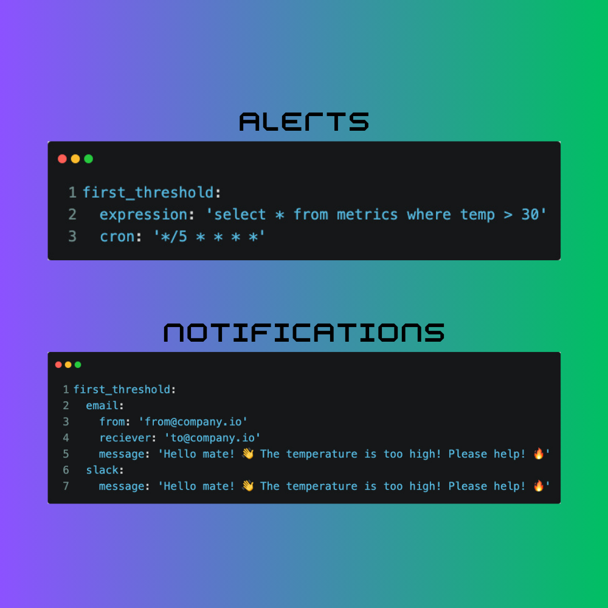

I am happy to officially introduce Emitbase — an open-source alerts platform for developers. It allows you to connect to a database, define the logic of alerts in SQL, and specify channels for alerts (Email or Slack), all configured in declarative YAML files.

The vision is to create a simple yet powerful alerting tool. It didn't come out of nowhere; it originated while I was building my last product. I needed a tool that wouldn't interfere with my business logic but would act as a straightforward layer directly above the database, allowing me to define alerting logic. Emitbase is exactly it.

## Eager for Feedback

I want to continue with development, but not everything I think is good is actually good. I am launching it with this piece of information in my mind, and I am super eager to receive feedback from the community! If Emitbase caught your attention, check [the introduction](https://emitbase.github.io/emitbase-website/docs/introduction), [try it](https://emitbase.github.io/emitbase-website/docs/getting-started), and provide me with any feedback on [Slack](https://emitbase.github.io/emitbase-website/docs/community/slack).

:::info

If you want to support Emitbase even more, please hit ⭐️ in the [Emitbase repository](https://github.com/emitbase/emitbase-core).

:::
