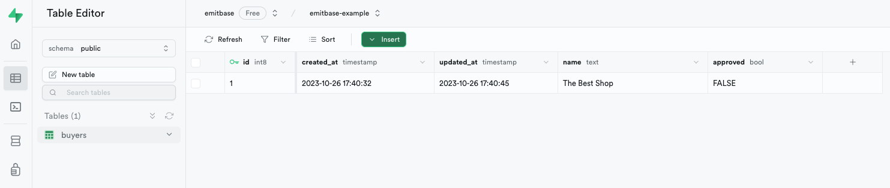
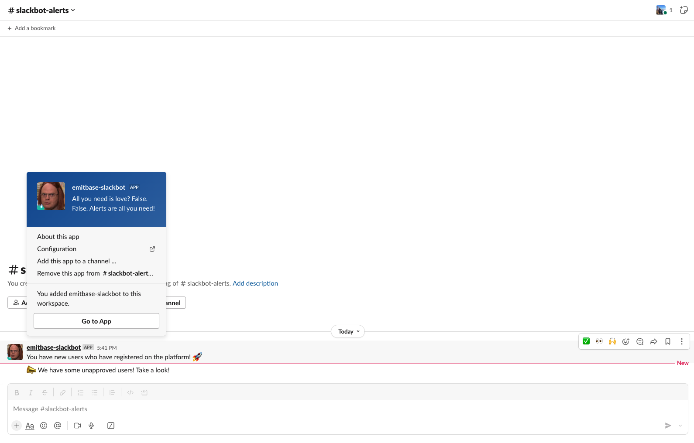

Sometimes, you may find the need to be notified about changes in your Supabase database as soon as possible. It can be for various reasons. For example, you may want to know if a new user registered, or if a critical business action occurs, such as a user adding an item to their shopping basket. This tutorial outlines a simple way to achieve this using [Emitbase](https://github.com/emitbase/emitbase-core) (an open-source alert platform for developers).

## Prerequisites

- [Node.js 18.12](https://nodejs.org/en/blog/release/v18.12.0) or later.
- [Docker](https://www.docker.com/) on your machine.
- Installed [Emitbase CLI](https://emitbase.github.io/emitbase-website/docs/getting-started#start-with-emitbase-cli).

## Supabase Table and the Requirements for Alerts

For the sake of simplicity, I have a basic table named `buyers` with the following columns:

- `id` (the table's identifier)
- `created_at` (the registration time of the user)
- `updated_at` (the time of the user's last update)
- `name` (the buyer's name)
- `approved` (a flag indicating if a user has been approved by an admin and can log into the application)



I want to receive a Slack message when the following events occur:

1. A new buyer registers within the last five minutes.
2. The 'buyers' table contains any rows where the 'approved' column has a 'FALSE' value.

## Step 1: Create a New Emitbase Project

```bash
$ npx emitbase init <your-project-name>
```

## Step 2: Set Up Your `profiles.yml`

First, create a credentials file:

```bash
$ touch profiles.yml
```

In the `profiles.yml` file, please define your credentials:

```bash
emitbase:
  databases:
    dev:
      host: <database-host>
      database: <database-name>
      port: <database-port>
      user: <database-username>
      password: <database-password>

  notifications:
    dev:
      slack:
        port: <slack-port>
        channel: <slack-channel>
        signingSecret: <slack-signing-secret>
        token: <slack-token>

  target: dev
```

:::tip

Check the [Integration with Slack](https://emitbase.github.io/emitbase-website/docs/guides/integration-with-slack) documentation page for more information about Slack credentials.

:::

## Step 3: Create Necessary Thresholds for Alerts

The first threshold must track whether a new buyer has registered within the last five minutes:

```yaml
new_users:
  expression: SELECT * FROM buyers WHERE created_at >= NOW() - INTERVAL '5 minutes'
  cron: '* * * * *'
```

The second threshold must track whether the 'buyer' table contains any rows where the `approved` value is `FALSE`.

```yaml
unapproved_users:
  expression: 'SELECT * FROM buyers WHERE approved = FALSE'
  cron: '* * * * *'
```

## Step 4: Create Alerts Messages

For new users:

```yaml
new_users:
  slack:
    message: 'You have new users who have registered on the platform! 🚀'
```

For unapproved rows:

```yaml
unapproved_users:
  slack:
    message: '📣 We have some unapproved users! Take a look!'
```

## Step 5: Build and Run Emitbase

To run the project, it is necessary to build a Docker image:

```bash
$ docker build -t emitbase .
```

Then, you can just run it and wait for notification on your slack! 🎉

```bash
$ docker run -it emitbase
```

## Showcase

The following images show messages in Slack. It's really simple; you can set up your alerts in minutes!



## Conclusion

For more information, please refer to the entire [Emitbase documentation](https://emitbase.github.io/emitbase-website/docs/introduction). If you encounter any issues, please feel free to [create an issue](https://github.com/emitbase/emitbase-core/issues/new). Lastly, if you appreciate Emitbase and would like to show your support, please give it a [star on GitHub](https://github.com/emitbase/emitbase-core). Thank you!